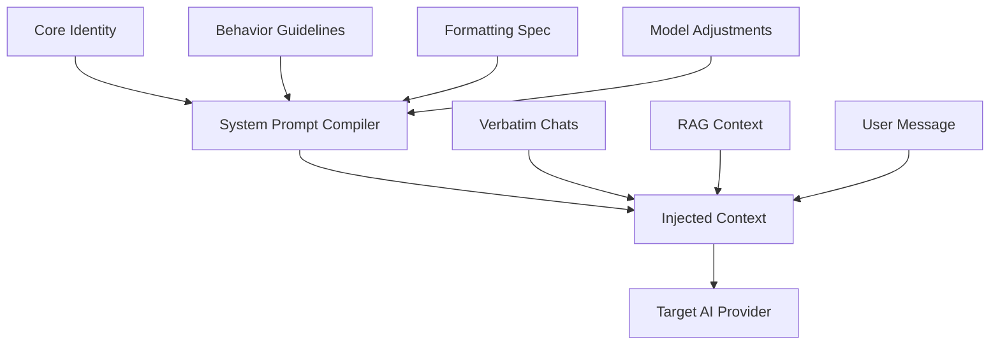

# AetherOS — Personal AI Operating System

AetherOS is a private, luxury-grade AI orchestration platform and coding workspace built for power users. This repository is entirely self-hosted and designed around a single authenticated local node user.

## Architecture Flow

The system prompt is compiled dynamically from granular, versioned markdown files:



## Tech Stack

- **Frontend**: Next.js 15 (standalone node build), React 19, Tailwind CSS v4, Zustand, TanStack Query, Framer Motion, KaTeX, Mermaid.
- **Backend**: FastAPI, SQLAlchemy, PostgreSQL, Redis, Docker.

## Project Structure

```
apps/
  web/                  ← Next.js 15 app
  api/                  ← FastAPI app
    prompts/            ← Prompt library md files
    app/prompt_engine/  ← Fluid compiler & optimizer
packages/
  types/                ← Shared TypeScript interfaces
  database/             ← SQLAlchemy schemas
  shared/               ← Utility helper functions
```

## Launch Guidelines

Initialize the entire platform in a single command using Docker Compose:

```bash
docker-compose up --build -d
```

- **Frontend Interface**: `http://localhost:3001`
- **Backend API Docs**: `http://localhost:8000/docs`
- **Health Check**: `http://localhost:8000/health`

## Command Key Mappings

- `Cmd + K` or `Ctrl + K` — Trigger the global command palette search overlay
- `ESC` — Dismiss current modals or overlay inputs
- `↵ Enter` — Select active command in palette list, or dispatch prompt message
